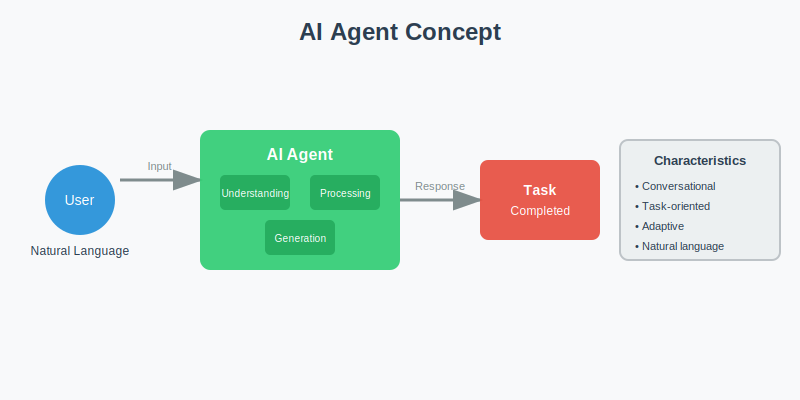
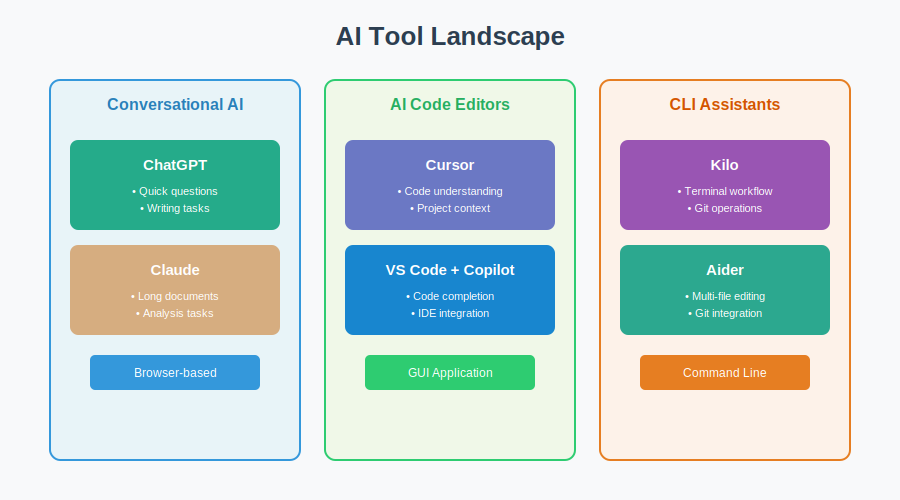

<!-- _class: lead -->

# Week 1

## Agent Tools Introduction

---

# Learning Objectives

By the end of this week, you should be able to:

- Explain what AI agent tools are and how they work at a high level
- Use ChatGPT and Claude for basic tasks (writing, explaining, analyzing)
- Install and explore Cursor editor for code understanding
- Understand when to use different tools for different tasks
- Write effective prompts to get quality results

---

# What is an AI Agent?



An AI agent is software that:
- Understands natural language instructions
- Helps you complete tasks through conversation
- Generates responses based on your input

**Key difference from traditional software:**
You don't learn commands — you describe what you want.

---

# The AI Tool Landscape



| Category | Tools | Interface |
|----------|-------|-----------|
| **Conversational AI** | ChatGPT, Claude, Gemini | Browser |
| **AI Code Editors** | Cursor, VS Code + Copilot | GUI Application |
| **CLI Assistants** | Kilo, Aider | Terminal |

---

<!-- _class: part -->

# Part 01
## Agent Tools Overview

`week_01/01_agent_tools_overview.md`

---

# Browser-Based vs Editor-Based


| | Browser (ChatGPT) | Editor (Cursor) |
|---|------------------|-----------------|
| **Setup** | Just login | Install application |
| **File access** | No | Yes (reads your files) |
| **Context** | You provide manually | Automatic from project |
| **Best for** | Quick tasks, writing | Code tasks, projects |

---

# Core Concepts: Prompts

A **prompt** is your instruction to the AI.

| Poor Prompt | Good Prompt |
|-------------|-------------|
| "Write an email" | "Write a professional email (under 200 words) to my manager requesting a training workshop. Tone: respectful but confident." |

**More specific = Better results**

---

# Core Concepts: Context

**Context** helps AI understand your situation.

Types of context:
- **Personal**: "I'm new to programming"
- **Task**: "This is for a client presentation"
- **File**: AI editors read your actual files

**More context = Better results**

---

<!-- _class: part -->

# Part 02
## ChatGPT and Claude Basics

`week_01/02_chatgpt_claude_basics.md`

---

# ChatGPT Setup

| Step | Action | Success |
|------|--------|---------|
| 1 | Go to chat.openai.com | Open website |
| 2 | Click "Sign Up" | Create account |
| 3 | Verify email/phone | Account active |
| 4 | Send a prompt | Receive response |

Free tier (GPT-3.5) is sufficient for this course.

---

# Claude Setup

| Step | Action | Success |
|------|--------|---------|
| 1 | Go to claude.ai | Open website |
| 2 | Click "Sign Up" | Create account |
| 3 | Verify email | Account active |
| 4 | Send a prompt | Receive response |

---

# ChatGPT vs Claude

| Aspect | ChatGPT | Claude |
|--------|---------|--------|
| Speed | Faster | Slightly slower |
| Length | Short-medium | Excellent for long docs |
| Style | Direct, concise | Detailed, thorough |
| Best for | Quick tasks, coding | Analysis, reasoning |

---

# Effective Prompt Patterns

**Pattern 1: Explainer**
```
Explain [topic] in simple terms, using analogies.
```

**Pattern 2: Writer**
```
Write a [type] about [topic], [length], for [audience], [tone].
```

**Pattern 3: Analyzer**
```
Analyze this [content] and provide [feedback type]:
[content]
```

---

<!-- _class: part -->

# Part 03
## Cursor Editor Introduction

`week_01/03_cursor_intro.md`

---

# Why Cursor?

**Cursor reads your files.** This means:
- AI knows your project structure
- AI sees file contents automatically
- Context is built-in, not manual

**In ChatGPT:** You paste code
**In Cursor:** AI reads the file directly

---

# Cursor Setup

| Step | Action | Success |
|------|--------|---------|
| 1 | Download from cursor.sh | Installer downloaded |
| 2 | Run installer | Cursor opens |
| 3 | Open a folder | Files in sidebar |
| 4 | Press Cmd+L (Mac) / Ctrl+L (Win) | AI chat opens |

---

# Cursor Interface

| Element | Shortcut | Purpose |
|---------|----------|---------|
| AI Chat | Cmd+L | Conversation about project |
| Inline Edit | Cmd+K | Edit at cursor position |
| File Explorer | Cmd+B | Navigate files |
| Terminal | Cmd+J | Run commands |

---

<!-- _class: part -->

# Part 04
## Kilo Guide

`week_01/04_kilo_guide.md`

---

# What is Kilo?

Kilo is an AI coding assistant for the **terminal**.

| Aspect | Cursor | Kilo |
|--------|--------|------|
| Interface | GUI | Terminal (CLI) |
| Git awareness | Partial | Strong |
| Automation | Manual | Scriptable |
| Preference | Visual workflow | Terminal workflow |

---

# Kilo Capabilities

| Capability | Example Command |
|------------|-----------------|
| Read files | "Explain what train.py does" |
| Write files | "Add comments to main.py" |
| Git operations | "Show recent commits" |
| Search | "Find where process_data is defined" |

---

<!-- _class: part -->

# Part 05
## AI Tools Comparison

`week_01/05_ai_tools_comparison.md`

---

# Which Tool When?

| Task | Best Tool |
|------|-----------|
| Quick questions | ChatGPT/Claude |
| Write text | ChatGPT/Claude |
| Understand code | Cursor |
| Modify code | Cursor/Kilo |
| Git operations | Kilo |
| Long document analysis | Claude |

---

# Decision Framework

**Ask yourself:**
1. Where is my content? (Head → Browser; Files → Editor/CLI)
2. What's my preference? (Browser → ChatGPT; GUI → Cursor; CLI → Kilo)
3. What's the task type? (Writing → ChatGPT; Code → Cursor/Kilo)

---

# Workshop / What to Complete

- Try at least 2 AI tools
- Complete 3 meaningful tasks:
  - Explain a concept
  - Summarize or rewrite content
  - Explore a simple file or project folder
- Save representative prompts and outputs
- Write "Agent Tool Usage Reflection" report (800-1000 words)

---

# Self-Check Questions

- Can you explain "what is an AI agent"?
- Can you list 4 tools and when to use each?
- Have you tried at least 2 tools?
- Did you save prompts or screenshots/notes?
- Can you write a specific, contextual prompt?

---

# References

- ChatGPT: https://chat.openai.com
- Claude: https://claude.ai
- Cursor: https://cursor.sh
- Prompt Engineering Guide: https://www.promptingguide.ai
