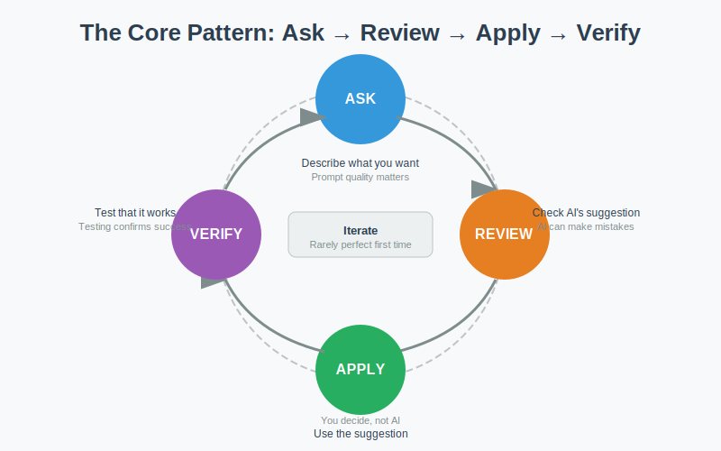
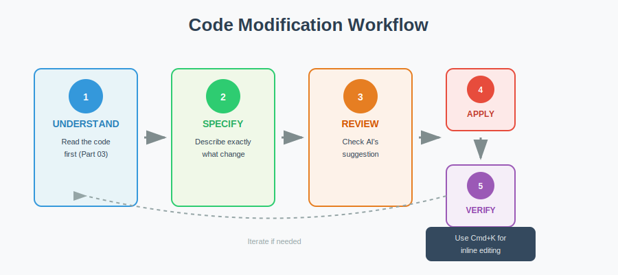

<!-- _class: lead -->

# Week 2

## IDE + AI-Assisted Code Practice

---

# Learning Objectives

By the end of this week, you should be able to:

- Set up Cursor or VS Code with AI integration
- Use AI to read and understand unfamiliar code
- Use AI to modify existing code safely
- Use AI to debug common errors
- Understand the AI-assisted programming workflow

---

# From Week 1 to Week 2+

| Week 1 | Week 2+ |
|--------|---------|
| Browser-based AI tools | IDE-based AI coding tools |
| Manual file context | Project/file context in workspace |
| Prompt experiments | Prompt + edit + verify workflow |
| Reflection on AI output | Recorded code practice evidence |

---

<!-- _class: part -->

# Part 01
## IDE Setup and AI Configuration

`week_02/01_ide_setup.md`

---

# Cursor Setup Checklist

| Step | Action | Success |
|------|--------|---------|
| 1 | Download Cursor or VS Code | Installer ready |
| 2 | Run installer | Cursor opens |
| 3 | Sign in if needed | AI features active |
| 4 | Open course repo | Files visible |
| 5 | Press Cmd+L | AI chat opens |

---

# Cursor Interface

| Element | Shortcut | Purpose |
|---------|----------|---------|
| AI Chat | Cmd+L | Conversational AI |
| Inline Edit | Cmd+K | Edit at cursor |
| File Explorer | Cmd+B | Browse files |
| Terminal | Cmd+J | Run commands |

---

# Two AI Modes

**Chat mode (Cmd+L):**
- Ask questions about your project
- Get explanations
- Plan modifications

**Inline mode (Cmd+K):**
- Select code → describe change
- AI edits directly in file

---

<!-- _class: part -->

# Part 02
## AI-Assisted Workflow

`week_02/02_ai_assisted_workflow.md`

---

# The Core Pattern: Ask → Review → Apply → Verify



```text
1. ASK:    Describe what you want
2. REVIEW: Check AI's suggestion
3. APPLY:  Use the suggestion (if appropriate)
4. VERIFY: Test that it works
```

---

# Why Each Step Matters

| Step | Why |
|------|-----|
| **ASK** | Prompt quality → response quality |
| **REVIEW** | AI can make mistakes |
| **APPLY** | You decide, not AI |
| **VERIFY** | Testing confirms it works |

---

# Iteration is Key

First prompts rarely give perfect results:

```text
1st: "Explain this function"
→ Too technical

2nd: "Explain in simpler terms"
→ Better but incomplete

3rd: "Focus on what it returns, with example"
→ Good!
```

---

<!-- _class: part -->

# Part 03
## Reading Code with AI

`week_02/03_reading_code_with_ai.md`

---

# Reading Workflow

```text
1. Identify: What file/function?
2. Ask: Prompt AI to explain
3. Review: Does explanation make sense?
4. Iterate: Ask follow-up questions
5. Apply: Take notes, build understanding
```

---

# Key Prompts for Reading

| Type | Example |
|------|---------|
| Overview | "What does this file do?" |
| Line-by-line | "Explain each line" |
| Concept | "What does 'def' mean?" |
| Purpose | "Why is this written this way?" |
| Example | "Give an example of using this" |

---

# Strategy: Start Broad, Then Narrow

```text
Broad:     "What does this file do?"
Narrow:    "Explain the first function"
Specific:  "What does line 3 do?"
```

---

<!-- _class: part -->

# Part 04
## Modifying Code with AI

`week_02/04_modifying_code_with_ai.md`

---

# Modification Workflow



```text
1. Understand: Read first (Part 03)
2. Specify: Describe exactly what change
3. Review: Check AI's suggestion
4. Apply: Accept change (Cmd+K or manual)
5. Verify: Test that it works
```

---

# Types of Modifications

| Type | Example Prompt |
|------|----------------|
| Comments | "Add comments explaining each line" |
| Error handling | "Add check for empty input" |
| Behavior change | "Return None instead of 0" |
| New functionality | "Add a function to find the maximum" |

---

# Using Inline Edit (Cmd+K)

1. **Select code**: Highlight function/lines
2. **Press Cmd+K**: Edit panel appears
3. **Describe change**: Type what you want
4. **Review**: Check highlighted change
5. **Accept or reject**: Click button

---

# Copy Before Edit

Keep `code_templates/` as the original reference.

```bash
cd week_02
mkdir -p modified_code
cp code_templates/simple_math.py modified_code/simple_math.py
cp code_templates/data_processing.py modified_code/data_processing.py
```

All modifications go in `modified_code/`.

---

<!-- _class: part -->

# Part 05
## Debugging with AI

`week_02/05_debugging_with_ai.md`

---

# Types of Errors

| Type | Example |
|------|---------|
| Syntax | Missing colon, wrong indentation |
| Runtime | Division by zero, index out of range |
| Type | Adding string and number |
| Logic | Wrong condition, wrong calculation |

---

# Debugging Workflow

```text
1. Identify: Error message, when it occurs
2. Ask AI: "Error: X. Code: Y. What's wrong?"
3. Review: Does AI correctly identify cause?
4. Apply: Use suggested fix
5. Verify: Run code, check error gone
```

---

# What to Tell AI

```text
I got this error: [exact error message]
Here's the code: [paste relevant code]
I was trying to: [describe your goal]
What's wrong and how do I fix it?
```

---

# Debugging Practice File

`debugging_practice.py` is intentionally broken.

```bash
cd week_02
mkdir -p modified_code
cp code_templates/debugging_practice.py modified_code/debugging_practice_fixed.py
python -B -m py_compile modified_code/debugging_practice_fixed.py
```

Fix one issue at a time, then record the prompt, fix, and verification.

---

# Run and Verify

Use small commands to check your work:

```bash
cd week_02
python --version
python -B -m py_compile modified_code/simple_math.py
cd modified_code
python -c "from simple_math import add_numbers; print(add_numbers(2, 3))"
```

---

# Workshop / What to Complete

- Set up Cursor or VS Code and open the course repo
- Explain at least 5 functions or code blocks
- Complete 2-3 small code modifications in `modified_code/`
- Complete 1 debugging record with error, prompt, fix, verification
- Write a short AI-assisted code practice reflection

---

# What to Submit

| File/folder | Purpose |
|-------------|---------|
| `report.md` | Explanations, modifications, reflection |
| `modified_code/` | Copied files with your changes |
| `debugging_record.md` | One complete debugging record |
| `prompts.md` | Prompt log and AI use notes |
| `README.md` | How to verify your work |

---

# Self-Check Questions

- Is Cursor installed and can you open AI chat?
- Can you explain the Ask → Review → Apply → Verify pattern?
- Can you explain 5 functions from templates?
- Can you make a small code change and verify it?
- Can you document one debugging process?

---

# References

- Cursor: https://cursor.sh
- Code templates: `week_02/code_templates/`
- Week 1: Prompt patterns for better prompts
